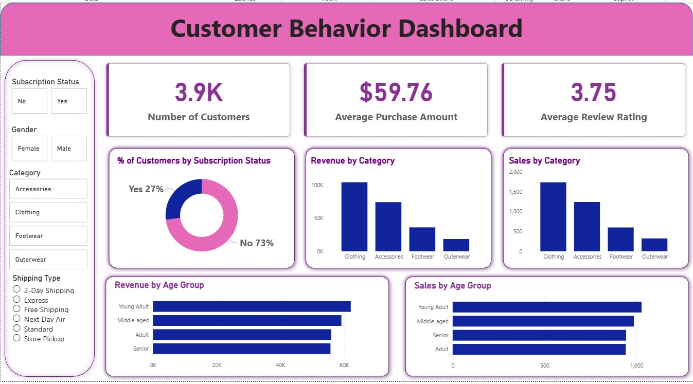

# Customer Trends Data Analysis


 
## Overview
     
This project analyzes customer shopping behavior using Python, SQL, SQLite, and Power BI.  
The goal is to uncover patterns in customer trends, purchasing behavior, and business performance through data cleaning, querying, and dashboard visualization. This project represents a complete, industry standard, end-to-end data analytics workflow, designed to mirror the real responsibilities of professional analysts in modern business environments. The project encompasses all critical stages of data analysis, from data preparation and modeling to insight generation, visualization, and reporting.   

## Project Highlights

- Cleaned and explored customer shopping data in Python
- Stored and queried data using SQLite and SQL
- Built an interactive Power BI dashboard
- Documented business findings and analysis in a professional format
  

## 📌 Project Overview

✅ Data Preparation,Modeling & Exploratory Data Analysis (Python): Clean and transform the raw dataset for analysis.

✅ Data Analysis (SQL): Simulate business transactions, and run queries to extract insights on customer segments, loyalty, and purchase drivers.

✅ Visualization & Insights (Power BI): Build an interactive dashboard that highlights key patterns and trends, enabling stakeholders to make data-driven decisions.

✅ Report and Presentation: Write a clear project report summarizing your key findings and business recommendations. Prepare a presentation that visually communicates insights and actionable recommendations to stakeholders.

## Tools Used

- Python
- Pandas
- SQLite
- SQL
- Power BI
- Jupyter Notebook

## Repository Structure

```text
Customer-Trends-Data-Analysis/
├── customer_shopping_behavior.csv
├── customer_behavior_sql_queries.sql
├── customer_behavior_dashboard.pbix 
├── Customer_Shopping_Behavior_Analysis.ipynb
├── Customer-Shopping-Behavior-Analysis.pptx
├── Business Problem Document.pdf
├── Customer Shopping Behavior Analysis.pdf
├── README.md
├── LICENSE
├── my_data.db
└── assets/
    ├── dashboard_overview.png
    ├── dashboard_sales.png
    ├── dashboard_customers.png
    └── dashboard_model.png


